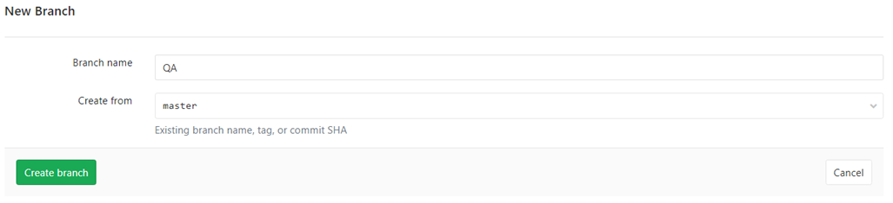
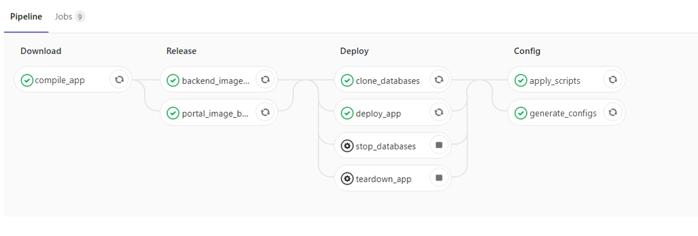
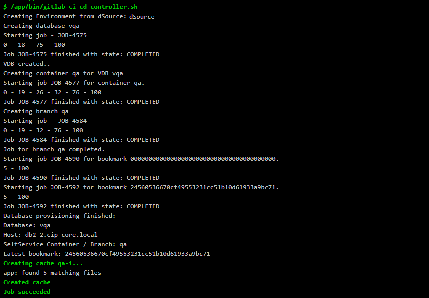
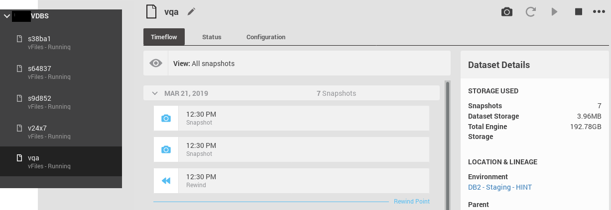
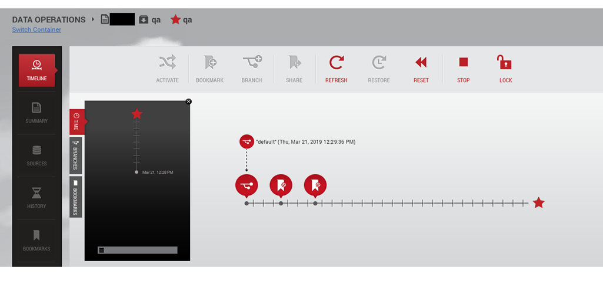
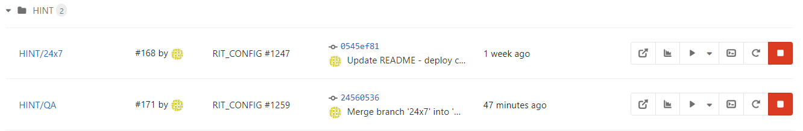
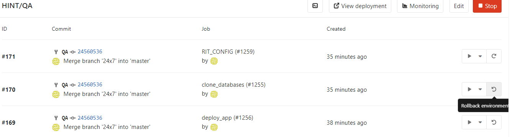

# Delphix integration for Gitlab CI/CD

This project uses the existing [Delphix Toolkit](https://github.com/delphix/dxtoolkit/) to create a Docker image that can be used inside [Gitlab CI/CD](https://docs.gitlab.com/ee/ci/) to provide database clones for [dynamic environments](https://docs.gitlab.com/ee/ci/environments.html#dynamic-environments).

Since all the logic is implemented with a [simple shell script](./bin/gitlab_ci_cd_controller.sh), it also works as an example to integrate with any other CI/CD tools you use. Just change it to fit your needs and fell free to contribute.

# Build locally 

```
docker built -t dxgitlabci:latest .
```

The command above will create a new image and you can run it locally if you want (just remember to set all the environment variables below),but it needs to be published somewhere so Gitlab Runner can pull it:
```
docker tag dxgitlabci:latest <your private repo>/dxgitlabci:latest
docker push <your private repo>/dxgitlabci:latest
```

Or you can just pull it from Docker Hub:
`docker pull dstolf/dxgitlabci:latest`

# Environment Variables

Every configuration should be passed as environment variables. Some of them are provided by [Gitlab CI/CD itself](https://docs.gitlab.com/ee/ci/variables/#predefined-environment-variables) but there are a few others that you'll need to set in your `Project Settings -> CI/CD -> Variables`. 

You can check all the variables in the table below:

|Variable Name               | Provided by Gitlab CI/CD | Description                                                                                           |
| ---------------------------- | ------------------------ | --------------------------------------------------------------------------------------------------- |
|CI_COMMIT_REF_SLUG          |yes                       | Gitlab's branch or tag name for which project is built                                                |
|CI_COMMIT_SHA               |yes                       | Gitlab's commit revision for which project is built                                                   |
|CI_COMMIT_BEFORE_SHA        |yes                       | Gitlab's previous latest commit present on a branch before a push request                             |
|CI_ROLLBACK                 |No                        | Set to `true` to enable rollbacks on re-deploys                                                       |
|APP_PREFIX                  |No                        | A short app identifier we can use to reference DB Groups and Containers in Delphix                    |
|DELPHIX_NAME                |No                        | Delphix Engine Name                                                                                   |
|DELPHIX_ADDRESS             |No                        | Delphix Engine Address                                                                                |
|DELPHIX_USER                |No                        | Delphix Engine User                                                                                   |
|DELPHIX_PASSWORD            |No                        | Delphix Engine Password                                                                               |
|DELPHIX_TARGET_ENVIRONMENT  |No                        | The name of the environment(host) where the DB will be provisioned                                    |
|DELPHIX_DB_TYPE             |No                        | Database Type                                                                                         |
|DELPHIX_ENV_INST            |No                        | The name of the instance where the DB will be provisioned                                             |
|DELPHIX_CONTAINER_OWNER     |No                        | Default Delphix Container Owner in SelfService (JS)                                                   |
|DELPHIX_DSOURCE             |No                        | If provided, will be used as dSource, otherwise will search for any dSource that containts APP_PREFIX |

Check [dxtoolkit docs](https://github.com/delphix/dxtoolkit/wiki) and [Gitlab's pre-defined environment variables](https://docs.gitlab.com/ee/ci/variables/#predefined-environment-variables) for further information on each one.

# Pre-reqs

- Add your dSource to Delphix first (otherwise we'll nothing to clone);
- It's advisable to set the DELPHIX_DSOURCE repo environment variable, otherwise we'll just pick the first dSource that containts APP_PREFIX on its name;
- A VDB Group named `${APP_PREFIX}-VDBS` should be previously created in Delphix.

# Screens

Create a new branch:


That will trigger the pipeline defined in `.gitlab-ci.yml`:


The pipeline step `clone_databases` will trigger the VDB creation:


New VDB:


And also a Delphix Self Service container, which will give you a nice view similar to a Git Graph:


After everything is done, you can manage the whole environment on Gitlab:


And triggering a rollback will retore your database to a bookmark linked to the commit hash:


# Example .gitlab-ci.yml

```
stages:
    - clone_db
    - schema_change

# Create a Delphix VDB clone and SelfService "container" from Master Database, 
# associated to git branch (if the VDB for this branch doesn't already exist).
# The generated VDB name will be 'echo v${CI_COMMIT_REF_SLUG:0:6}| sed 's/-/_/g')'
# Create bookmarks for CI_COMMIT_BEFORE_SHA and CI_COMMIT_SHA.
# Running this step again manually (re-deploy or rollback change on Gitlab's Environment page)
# will trigger a rollback in Delphix to bookmark CI_COMMIT_SHA (if CI_ROLLBACK=true).
clone_databases:
    image: dstolf/dxgitlabci:latest
    stage: clone_db
    only:
      - branches
      - tag
    except:
      - master
    environment:
      name: QA/$CI_BUILD_REF_NAME
      on_stop: stop_databases
    script:
      - cd /app/bin
      - /app/bin/gitlab_ci_cd_controller.sh

# Run your scripts
# You can retrieve the host information from Delphix or save it as a CI/CD environment variable in Gitlab
# The database name is composed by the first 6 letters of the branch or tag name, preceded by the letter 'v' and replacing all '-' by '_')
# DB_NAME=$(echo v${CI_COMMIT_REF_SLUG:0:6}| sed 's/-/_/g'))
exec_scripts:
    image: oracle-instant-client:latest # just an example, use whatever image you have built to run your schema changes
    stage: schema_change
    only:
      - branches
      - tag
    except:
      - master
    environment:
      name: QA/$CI_BUILD_REF_NAME
    script:
    - your schema change logic here
    - run migrations, exec scripts, handle errors etc etc
    - when working on a VDB, don't worry about rolling back changes, just return error and 'rollback_databases' will do the rest

# If there was any error on exec_scripts and CI_ROLLBACK env variable is enabled, 
# this step will trigger Delphix to restore the latest save point ($CI_COMMIT_SHA)
# notice that whis step of the stage `schema_change` will be run only if `exec_scripts` step returns error
rollback_databases:
    image: dstolf/dxgitlabci:latest
    stage: schema_change
    only:
      - branches
      - tag
    except:
      - master
    environment:
      name: QA/$CI_BUILD_REF_NAME
    when: on_failure
    script:
      - cd /app/bin
      - /app/bin/gitlab_ci_cd_controller.sh


# Disable Delphix SelfService Container
# manual step to teardown the dynamic environment (ex. when a branch is deleted)
stop_databases:
  image: dstolf/dxgitlabci:latest
  stage: clone_db
  variables:
    GIT_STRATEGY: fetch
  when: manual
  only:
    - branches
    - tags
  except:
    - master
  environment:
    name: QA/$CI_BUILD_REF_NAME
    action: stop
  script:
    - cd /app/bin/
    - dx_ctl_js_container -action disable -container_name $CI_COMMIT_REF_SLUG

```
